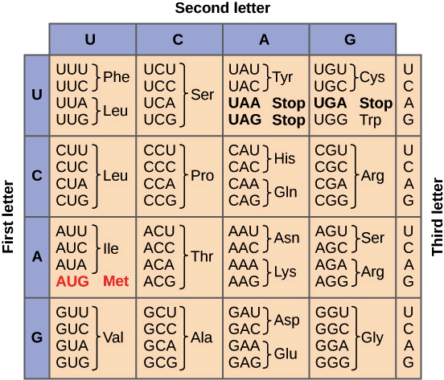

---

title: 非天然氨基酸
description: Noncanonical amino acids
slug: ncAA
date: 2023-08-02 00:00:00+0000
image: 
categories:
    - DNA
    - Protein Labling
# tags:
#     - Tag

# links:
#   - title: GitHub
#     description: GitHub is the world's largest software development platform.
#     website: https://github.com
#     image: https://github.githubassets.com/images/modules/logos_page/GitHub-Mark.png
#   - title: TypeScript
#     description: TypeScript is a typed superset of JavaScript that compiles to plain JavaScript.
#     website: https://www.typescriptlang.org
#     image: ts-logo-128.jpg

---
## 背景

生命在地球上延诞生，漫长的时间使得不同生物之间的遗传信息千差万别，但是书写这些遗传信息的语言却保持着高度的统一性，由A、G、C和T（或者U）组成，并且能够每三个作为一个翻译单元，按照几乎一样的规则翻译成组成蛋白质的20个氨基酸。

但是在一些古菌中存在21或者22种氨基酸，而这些额外的氨基酸的引入也需要一些额外的与之对应的密码子、tRNA以及对应的氨酰tRNA合成酶。比如UGA在大多是生物中作为终止密码子标志着蛋白质的翻译停止，在某些生物中UGA则能够被理解为硒代半胱氨酸的编码。

对于密码子的选择有两种方式，一种是选择在正常生物中不负责编码蛋白质的终止密码子，目前最常用的是琥珀终止密码子UAG，因为UAG是终止密码子中出现率较低的一个，因而较常使用[^1]。而另一种被称之为移位密码子，是在原始的三位密码子的基础之上增加一到两个碱基，称之为四联体密码子或者五联体密码子，从而实现了更高的灵活性，以及对于宿主内源tRNA的竞争性识别也会更弱[^2]。

[^1]:https://www.science.org/doi/10.1126/science.2649980
[^2]:https://chemistry-europe.onlinelibrary.wiley.com/doi/10.1002/cbic.201402104

## 筛选氨基酸-tRNA-氨酰tRNA合成酶正交组

对于正交体系的设计不只是特异性密码子的设计，为希望引入的非天然氨基酸具有着天然氨基酸所不具有的功能基团，因而如何筛选出能将非天然氨基酸和对应的tRNA催化合成对应的氨酰tRNA才是该系统能够发挥功能的关键[^3]。

[^3]:https://pubs.acs.org/doi/10.1021/acschembio.7b00974

但是现存的氨基酸-tRNA组合都是在漫长的生物进化过程中进化所得，因而想要完全de-novo地设计出一对与目的宿主内翻译体系正交的氨基酸-tRNA正交的作用过于复杂与困难了，而选择与之亲缘关系较远的物种中现存的氨酰合成酶，在此基础之上进行优化和筛选，该过程就能简化许多。

![图2：筛选正交aaRS–tRNA[^4]](pipeline.png)

[^4]:https://www.nature.com/articles/s41587-020-0479-2

人们